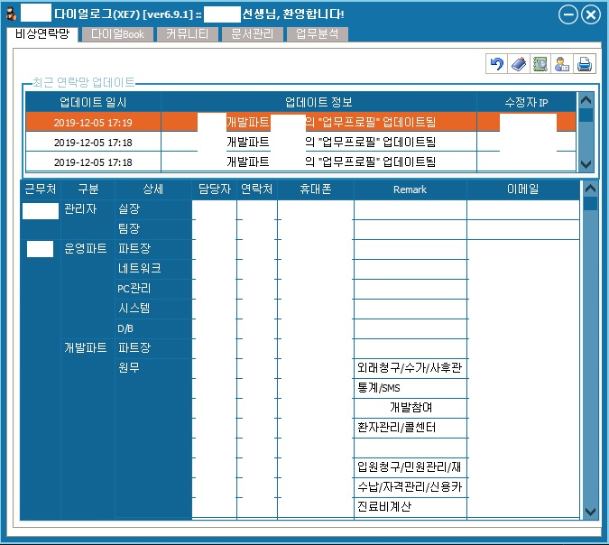
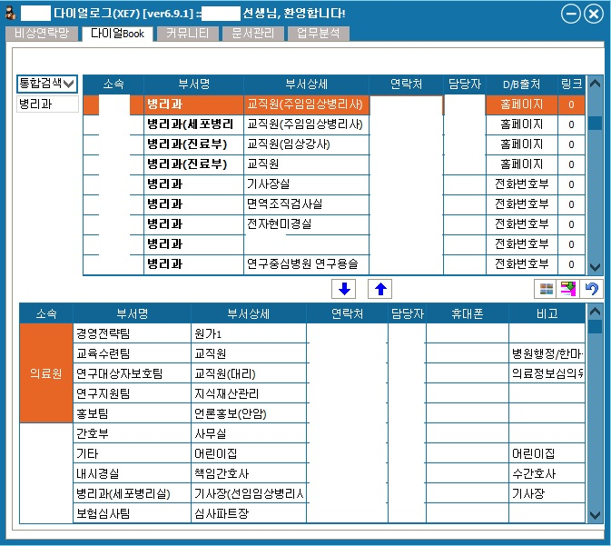
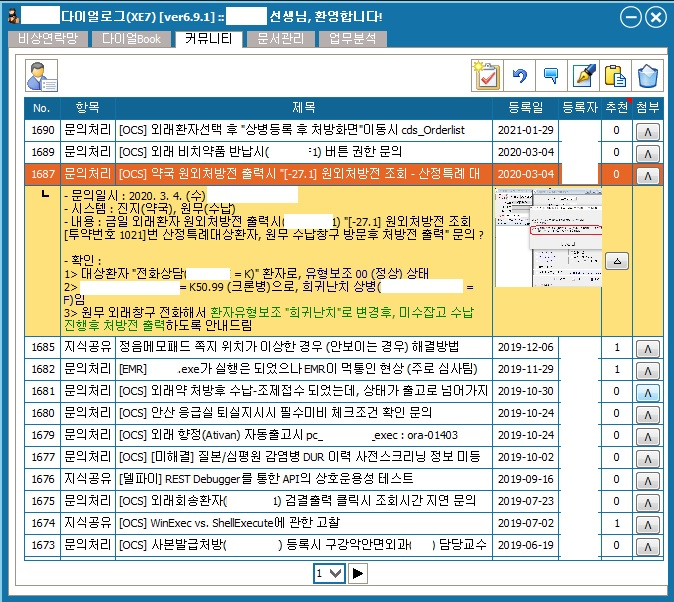

# K-Dialog-app.
It's my own 1st win32 application using Delphi (D5->XE7 migrated)

## 배경 
### (feat. 아래의 문제의식에 대해 몇 가지 가설을 통해 실험해 보고자 시도했던 삽질들)
병원 전산실은 적은 인원이 멀티업무를 담당하면서도 코드리뷰와 도큐멘테이션(위키), 그리고 트러블 슈팅케이스 및 업무 히스토리에 대한 체계적 관리를 안하는 것일까, 못하는 것일까.

## 기술스택
3-tier (oracle-TMAX-delphi)

## 주요 features
- 전산실 업무 유닛별 상세정보 (비상연락망)

- 병원 홈페이지 db + 부서 비상연락망 db 연동 (다이얼북)

- 자료 아카이빙 (커뮤니티)

- 도큐멘테이션 (문서관리)

- 그 외 (업무일지 등)

